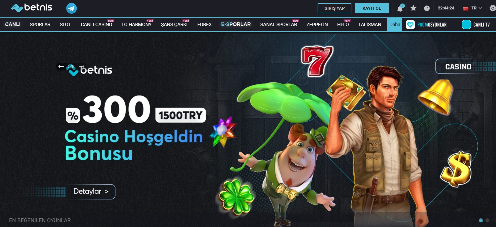

Betnis438 | Betnis 438 | Betnis Giriş Adresi
===================================

   
Betnis platformunun en kaliteli giriş adresi **betnis438.com** isminde yazılmıştır. Mobil cihazlardan canlı rulet ofislerine ulaşım sağlama sorunu yaşayan rulet tutkunları tam da bu anki değişen aktif giriş adresi arzusuna girişmişlerdir. Biz de üstümüze düşen sorumluluğu yerine getirmek amacıyla aralıksız illegal canlı casino sitelerini belirterek kayıt yaptıracaklara yardımcı olacağız. Konuşulan Rekorbet458, Vaycasino153, 714Bahsine ve Betbox2222 içerikleridir.

`SİTEYE ERİŞİM İÇİN TIKLAYIN! <https://uclck.me/gonow>`_
==============

.. list-table:: **SON ADRES DEĞİŞİKLİKLERİ**
   :widths: 100
   :header-rows: 1

   * - FİRMA
   * - `Goldenbahis707 | Goldenbahis 707 <goldenbahis707-goldenbahis-707-goldenbahis-giris-adresi.html>`_
   * - `Lidyabet557 | Lidyabet 557 <lidyabet557-lidyabet-557-lidyabet-giris-adresi.html>`_
   * - `Asyabahis907 | Asyabahis 907 <asyabahis907-asyabahis-907-asyabahis-giris-adresi.html>`_	 
   * - `Prensbet286 | Prensbet 286 <prensbet286-prensbet-286-prensbet-giris-adresi.html>`_	 
   * - `438Piabet | 438 Piabet <438piabet-438-piabet-piabet-giris-adresi.html>`_ 
   * - `Prizmabet507 | Prizmabet 507 <prizmabet507-prizmabet-507-prizmabet-giris-adresi.html>`_
   * - `Pusulabet736 | Pusulabet 736 <pusulabet736-pusulabet-736-pusulabet-giris-adresi.html>`_	 
   * - `Sekabet1156 | Sekabet 1156 <sekabet1156-sekabet-1156-sekabet-giris-adresi.html>`_
   * - `Bet10bet451 | Bet10bet 451 <bet10bet451-bet10bet-451-bet10bet-giris-adresi.html>`_
   * - `Padişahbet601 | Padişahbet 601 <padisahbet601-padisahbet-601-padisahbet-giris-adresi.html>`_
	 
Betnis438 İstatistikleri:
===================================	 
* Adres değişikliği inceleme sayısı: 184
* Google'dan gelen ziyaretçi sayısı: 1901
* Yandex'den gelen ziyaretçi sayısı: 1120
* Younow'dan gelen ziyaretçi sayısı: 522
* Duckduckgo'dan gelen ziyaretçi sayısı: 1210
* Slot Oyunu Oynayanlar: 1700
* Canlı Bahis Yapanlar: 1904
* Firmayı Beğenenlerin Yüzdelik Sayısı(%): %71
* Ortalama Kazanma Şansınız Yüzdelik Olarak(%): %79
* Günlük Ortalama Ziyaretçi Sayısı: 220
